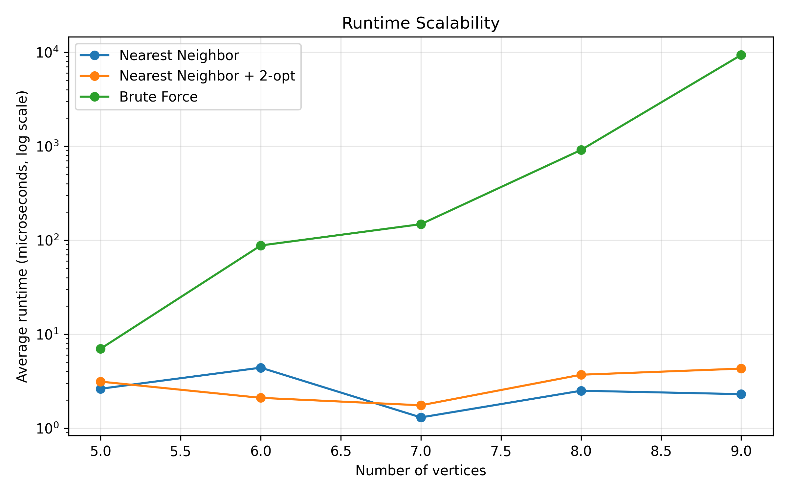
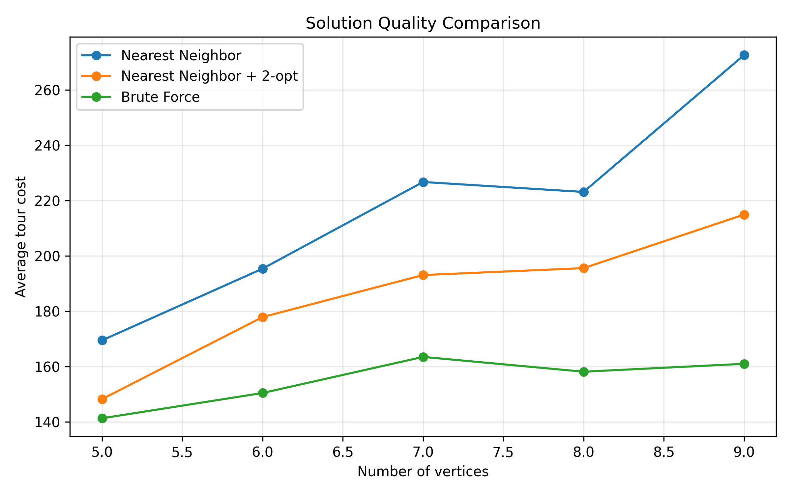
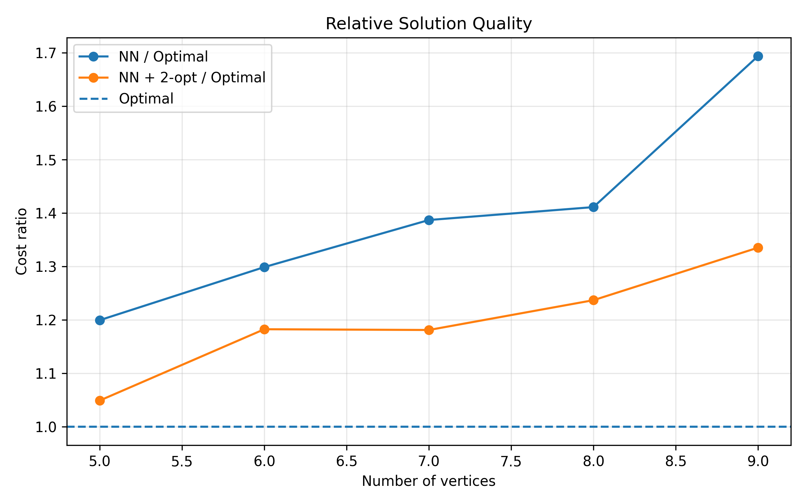
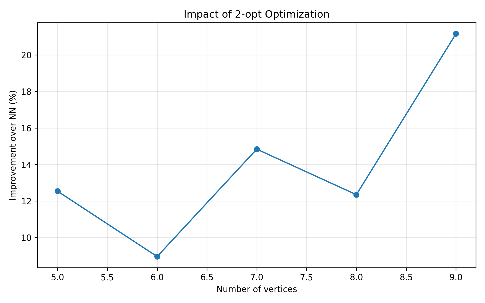
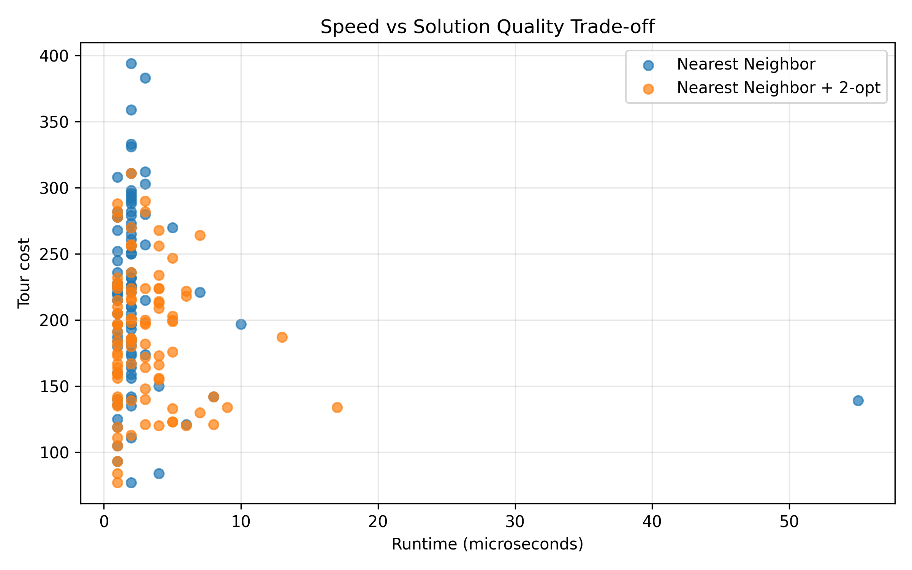
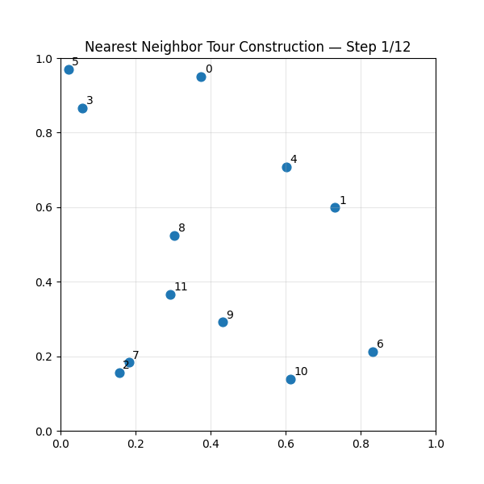
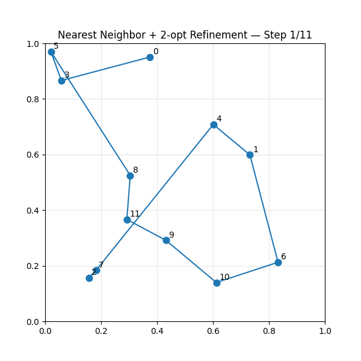

# Traveling-Salesman-Problem-Benchmark

This repository provides an experimental benchmark of several algorithms used to solve the **Traveling Salesman Problem (TSP)**. The goal of this project is to analyze the **trade-off between runtime performance and solution quality** across different approaches.

The algorithms are implemented in **C++**, while **Python (Pandas + Matplotlib)** is used for data analysis and visualization of benchmark results.

---

# Traveling Salesman Problem

The **Traveling Salesman Problem (TSP)** is one of the most well-known problems in combinatorial optimization.

Given a set of cities and the distances between them, the objective is to determine the **shortest possible route that visits each city exactly once and returns to the origin city**.

TSP is classified as an **NP-hard problem**, meaning that exact solutions become computationally expensive as the number of cities increases.

---

# Algorithms Implemented

## 1. Nearest Neighbor (NN)

A greedy heuristic that constructs a tour by repeatedly selecting the nearest unvisited city.

Advantages:
- Extremely fast
- Simple to implement

Limitations:
- May produce suboptimal routes

---

## 2. Nearest Neighbor + 2-opt

This method improves the greedy solution using **2-opt local search optimization**.
The algorithm repeatedly removes two edges and reconnects them in a way that reduces the total tour length.

Advantages:
- Significantly improves solution quality
- Still computationally efficient

---

## 3. Brute Force (Optimal Baseline)

The brute force method enumerates **all possible permutations of city tours** to guarantee the optimal solution.

Time complexity: O(n!)


This approach is only practical for **very small graphs**.

---

# Algorithm Complexity Comparison

| Algorithm | Time Complexity | Optimal |
|----------|----------------|--------|
| Nearest Neighbor | O(n²) | No |
| Nearest Neighbor + 2-opt | O(n³) | No |
| Brute Force | O(n!) | Yes |

---

# Experimental Benchmark

The benchmark generates **random complete graphs** and evaluates each algorithm across multiple test runs.

Evaluation metrics include:

- Runtime (microseconds)
- Tour cost
- Relative solution quality
- Improvement from 2-opt optimization

---

# Benchmark Results

## Runtime Scalability



The brute force algorithm grows exponentially as the number of vertices increases, while heuristic methods remain efficient.

---

## Solution Quality



Nearest Neighbor produces reasonable solutions, while the **2-opt refinement significantly improves tour quality**.

---

## Relative Solution Quality



This ratio shows how close heuristic solutions are compared to the optimal brute-force solution.

---

## Impact of 2-opt Optimization



The optimization step significantly reduces the total tour cost.

---

## Runtime vs Solution Quality Trade-off



This visualization highlights the engineering trade-off between **speed and accuracy**.

---

## Algorithm Visualization

### Nearest Neighbor Tour Construction



### Nearest Neighbor + 2-opt Refinement



These animations illustrate how the greedy heuristic constructs a tour and how the **2-opt local search** improves the route.

---

## Interactive Benchmark Dashboard

An interactive dashboard is available in:

```text
benchmark_dashboard.html
```

It allows exploration of runtime scalability, solution quality, and optimization improvements across algorithms.
---


# Benchmark Summary

| Observation | Result |
|-------------|--------|
| Fastest Algorithm | Nearest Neighbor |
| Best Practical Trade-off | NN + 2-opt |
| Optimal Algorithm | Brute Force |
| Scalability | Heuristics scale significantly better |

---

## Project Pipeline

```
Benchmark Generator (C++)
        ↓
Algorithm Execution
        ↓
Raw Benchmark Data (CSV)
        ↓
Data Analysis (Python + Pandas)
        ↓
Visualization (Matplotlib)
```

---

## Repository Structure

```
Traveling-Salesman-Problem-Benchmark
│
├── benchmark.cpp
├── tsm.cpp
├── tsm.h
├── bellman.cpp
├── bellman.h
├── main.cpp
│
├── plot_results.py
├── generate_tsp_animation.py
├── benchmark_dashboard.py
│
├── results.csv
├── benchmark_summary.csv
├── benchmark_readme_table.csv
│
├── tsp_nn_demo.gif
├── tsp_nn_2opt_demo.gif
│
├── benchmark_dashboard.html
│
├── 01_runtime_scalability.png
├── 02_solution_quality.png
├── 03_relative_quality.png
├── 04_two_opt_impact.png
├── 05_tradeoff_runtime_vs_quality.png
├── 06_solution_stability.png
│
└── README.md
```

---

## How to Run

### Compile Benchmark

```bash
g++ -O2 -std=c++17 benchmark.cpp tsm.cpp -o benchmark.exe
```

### Run Benchmark

```bash
./benchmark.exe
```

This command will generate:

```
results.csv
```

### Generate Plots

```bash
python plot_results.py
```

The script will automatically generate all benchmark visualization figures.

---

## Technologies

- C++
- Python
- Pandas
- Matplotlib
- Git

---

## Performance Evaluation

To evaluate the effectiveness of the implemented algorithms, a benchmark was conducted using randomly generated complete graphs.

Each algorithm was tested on multiple graph instances with varying numbers of vertices.

Evaluation metrics:

- **Runtime** (microseconds)
- **Tour cost**
- **Relative solution quality**
- **Improvement from local optimization**

  ---


### Key Findings

- **Nearest Neighbor** is the fastest algorithm but often produces suboptimal tours.
- **Nearest Neighbor + 2-opt** significantly improves solution quality with minimal additional computational cost.
- **Brute Force** guarantees the optimal solution but becomes computationally infeasible as the number of vertices increases.

The benchmark demonstrates that combining greedy heuristics with local optimization provides the best practical trade-off between performance and accuracy.

## Key Insights

- Greedy heuristics provide fast but sometimes suboptimal solutions.
- Local search optimization (2-opt) significantly improves greedy solutions.
- Exact algorithms guarantee optimality but scale poorly for large graphs.
- Combining heuristics with local optimization provides the best practical trade-off between speed and solution quality.

---

## Author
**Le Hien Vinh**  

Ho Chi Minh City University of Technology
